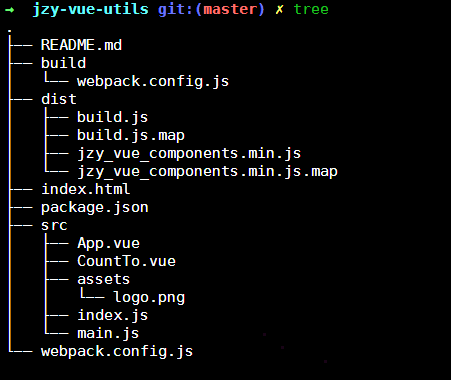

# [jzy-vue-utils](https://github.com/jingkeke/jzy-vue-utils)
- learn how to publish vue components and as utils for myself.
- vue utils 练习参考[带你封装一个 vue component](https://segmentfault.com/a/1190000009090836) ,不过里面对应的 coutup.js 接口变了

## 使用
- import 方式

看了一下上传npm的包，了解如何使用
```js
<template>
    <CountTo end-val="100"   ></CountTo>
</template>
<script>
import CountTo from 'jzy-vue-utils'
export default {
  components: { CountTo }
</script>

```
- html中使用
```html
<script src="https://unpkg.com/jzy-vue-utils@1.0.1/dist/jzy_vue_components.min.js"></script>
...
<div>
 <count-to end-val="100"   ></count-to>
</div>

```


## Build Setup
```bash
# install dependencies
npm install

# serve with hot reload at localhost:8080
# 如果是自己测试一下组件 ,配置webpack.config.js 里面放开注释 entry: './src/main.js',
npm run dev

# build 是调用的buid目录里面的webpack 配置
npm run build
```

For detailed explanation on how things work, consult the [docs for vue-loader](http://vuejs.github.io/vue-loader).

## package.json
```
// 作为import 引入的入口
 "main": "dist/jzy_vue_components.min.js",
// 上传哪些文件
  "files": ["dist"]
```
